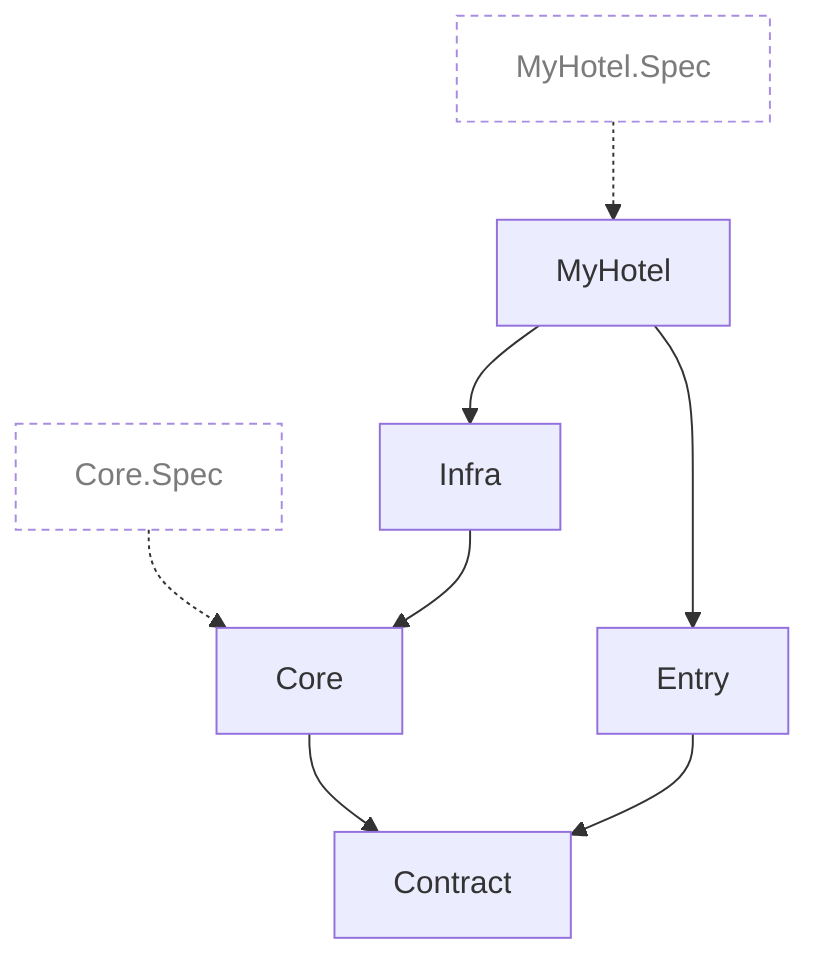

# My Hotel

<!-- Generated by TSpec from MyHotel.Architecture.Spec. Do not edit by hand. -->

```mermaid
flowchart TD
    MyHotel
    Contract
    Core
    Core_Spec["Core.Spec"]:::spec
    Entry
    Infra
    MyHotel_Spec["MyHotel.Spec"]:::spec
    MyHotel --> Entry
    MyHotel --> Infra
    Core --> Contract
    Core_Spec -.-> Core
    Entry --> Contract
    Infra --> Core
    MyHotel_Spec -.-> MyHotel
    classDef spec fill:none,stroke-dasharray:4 3,opacity:0.8
```
