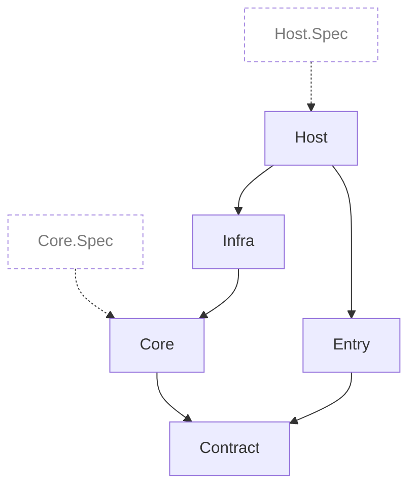

# My Hotel

<!-- Generated by TSpec from MyHotel.Architecture.Spec. Do not edit by hand. -->


```mermaid
flowchart TD
    Contract
    Core
    Core_Spec["Core.Spec"]:::spec
    Entry
    Host
    Host_Spec["Host.Spec"]:::spec
    Infra
    Core --> Contract
    Core_Spec -.-> Core
    Entry --> Contract
    Host --> Entry
    Host --> Infra
    Host_Spec -.-> Host
    Infra --> Core
    click Core "../Core.Spec/_specification/README.md"
    click Host "../Host.Spec/_specification/README.md"
    classDef spec fill:none,stroke-dasharray:4 3,opacity:0.8
```

## Dependencies

### [Folder cycles](Dependencies/FolderCycles.cs)

- **No top level folders use each other around a loop**\
  `Source.Projects[project].Folders is acyclic`

### [Layers](Dependencies/Layers.cs)

- **Contract declares only public types** — `Types of "Contract" has all type.IsPublic`
- **Contract nests no type** — `Types of "Contract" has none type.Nested.Count > 0`
- **Infra declares no interface**\
  `All types of "Infra" has none type.Kind == DeclaredKind.Interface`

### [Project dependencies](Dependencies/ProjectDependencies.cs)

- **Are only these and not redundant**

  | Project   | May reference | May use                        |
  | --------- | ------------- | ------------------------------ |
  | Contract  | -             | Microsoft.*                    |
  | Core      | Contract      | Microsoft.*                    |
  | Core.Spec | Core          | *                              |
  | Entry     | Contract      | Microsoft.*                    |
  | Host      | Entry, Infra  | Scalar.AspNetCore, Microsoft.* |
  | Host.Spec | Host          | *                              |
  | Infra     | Core          | Microsoft.*                    |

  ```
  Source.Projects is within what is allowed
      and non redundant
  ```
- **Entry never reaches core** — `Source.Projects["Entry"].Reaches does not contain "Core"`

### [Subdomain dependencies](Dependencies/SubdomainDependencies.cs)

- **In core a subdomain uses only the ones the graph draws below it**\
  `Source.Projects["Core"].Folders is within what is allowed`

  ```mermaid
  flowchart TD
      Bookings
      Rooms
      Bookings --> Rooms
  ```

  | Folder   | May use |
  | -------- | ------- |
  | Bookings | Rooms   |
  | Rooms    | -       |

## Exposure

### [Enumerable members](Exposure/EnumerableMembers.cs)

- **A member another class calls returns no enumerable**\
  `Source.Projects[project].Members has none ReturnsAnEnumerable`
- **An enumerable parameter is referenced exactly once**\
  `Source.Projects[project].Members.SelectMany(ParametersReadOtherThanOnce) is empty`
- **The references to a parameter are the names that resolve to it**\
  `References in Method(method) is references`

  | method                                                                  | references |
  | ----------------------------------------------------------------------- | ---------- |
  | "int Count(IEnumerable<int> rows) => rows.Count();"                     | 1          |
  | "int Twice(IEnumerable<int> rows) => rows.Count() + rows.Sum();"        | 2          |
  | "int Max(IEnumerable<int> rows) => rows.Max(row => new[] { row }.Max(r… | 1          |

- **A parameter holds an enumerable however its type is written**\
  `Holds an enumerable Method(method) is true`

  | method                                         |
  | ---------------------------------------------- |
  | "int Count(IEnumerable<int> rows) => 0;"       |
  | "int Count(Rows rows) => 0;"                   |
  | "int Count(Func<IEnumerable<int>> rows) => 0;" |
  | "int Count(IEnumerable<int>[] rows) => 0;"     |

- **A type that only implements one holds none**\
  `Holds an enumerable Method(method) is false`

  | method                                     |
  | ------------------------------------------ |
  | "int Count(IReadOnlyList<int> rows) => 0;" |
  | "int Count(string rows) => 0;"             |

### [Mutable collections](Exposure/MutableCollections.cs)

- **No member takes or returns a mutable collection**\
  `Source.Projects[project].Members has none PassesAMutableCollection`

### [Public types](Exposure/PublicTypes.cs)

- **A public type is named by another project or in a public signature**\
  `Source.Projects[project].AllTypes.Where(type => type.IsPublic) has all needed project, type`

### [Tuple members](Exposure/TupleMembers.cs)

- **A public or internal member neither returns nor takes a tuple**\
  `Source.Projects[project].Members has none member.IsExposed && member.Carries(IsTuple)`

### [Wire types](Exposure/WireTypes.cs)

- **No wire property carries an enum a time or an object**\
  `Contract.Members.Where(IsWireProperty) has none Refused`
- **An enum with the system text json converter is converted**\
  `Converted EnumIn("[JsonConverter(typeof(JsonStringEnumConverter))]") is true`
- **An enum with a json converter of our own is not**\
  `Converted EnumIn("[Own.JsonConverter]") is false`

## Idioms

### [Append chains](Idioms/AppendChains.cs)

- **A chain of appends holds at most one fixed text**\
  `Source.Projects[project].Nodes<InvocationExpressionSyntax>() has none EndsATextInParts`

### [Catches](Idioms/Catches.cs)

- **No catch takes every exception**\
  `Source.Projects[project].Nodes<CatchClauseSyntax>() has none TakesEverything`
- **A catch takes every exception** — `Takes everything CatchIn(clause) is true`

  | clause                                                 |
  | ------------------------------------------------------ |
  | "catch { }"                                            |
  | "catch (Exception) { }"                                |
  | "catch (System.Exception e) { }"                       |
  | "catch (global::System.Exception e) { }"               |
  | "catch (Exception e) when (e is TimeoutException) { }" |
  | "catch (Exception e) { if (cancelled) throw; }"        |
  | "catch (Exception e) { Log(e); throw; }"               |
  | "catch (Exception e) { throw Malformed(e); }"          |
  | "catch (Error) { }"                                    |

- **A catch takes only the types it names or rethrows**\
  `Takes everything CatchIn(clause) is false`

  | clause                                                  |
  | ------------------------------------------------------- |
  | "catch (TimeoutException) { }"                          |
  | "catch (IOException e) when (e.HResult == 32) { }"      |
  | "catch (Exception e) when (Log(e)) { throw; }"          |
  | "catch (Exception e) when (Log(e) && false) { throw; }" |

### [Default comparers](Idioms/DefaultComparers.cs)

- **No to hash set passes the default comparer**\
  `Source.Projects[project].Nodes<ArgumentSyntax>() has none DefaultComparer`
- **To hash set passes the default comparer** — `Passes the default SetBy(call) is true`

  | call                                                  |
  | ----------------------------------------------------- |
  | "words.ToHashSet(StringComparer.Ordinal)"             |
  | "words.ToHashSet(System.StringComparer.Ordinal)"      |
  | "words.ToHashSet(EqualityComparer<string>.Default)"   |
  | "Enumerable.ToHashSet(words, StringComparer.Ordinal)" |
  | "words.ToHashSet(Strings.Ordinal)"                    |
  | "words.ToHashSet(Ordinal)"                            |

- **To hash set passes another or none** — `Passes the default SetBy(call) is false`

  | call                                                 |
  | ---------------------------------------------------- |
  | "words.ToHashSet()"                                  |
  | "words.ToHashSet(StringComparer.OrdinalIgnoreCase)"  |
  | "new HashSet<string>(words, StringComparer.Ordinal)" |

### [Null forgiving](Idioms/NullForgiving.cs)

- **An expression holds at most one null forgiving operator**\
  `Source.Projects[project].Nodes<PostfixUnaryExpressionSyntax>() has none DoublyForgiven`

### [Query syntax](Idioms/QuerySyntax.cs)

- **No query is written in query syntax**\
  `Source.Projects[project].Nodes<QueryExpressionSyntax>() is empty`

### [Suppressions](Idioms/Suppressions.cs)

- **No source switches a warning off**\
  `Source.Projects[project].Nodes<SyntaxNode>() has none Suppressing`
- **An attribute switches a warning off** — `Suppresses OnAClass(attribute) is true`

  | attribute                                                                        |
  | -------------------------------------------------------------------------------- |
  | "[SuppressMessage("Style", "IDE0001")]"                                          |
  | "[System.Diagnostics.CodeAnalysis.SuppressMessageAttribute("Style", "IDE0001")]" |
  | "[UnconditionalSuppressMessage("Trimming", "IL2026")]"                           |
  | "[Quiet("Style", "IDE0001")]"                                                    |

- **Another attribute does not** — `Suppresses OnAClass(attribute) is false`

  | attribute                        |
  | -------------------------------- |
  | "[Obsolete]"                     |
  | "[NotASuppressMessage("Style")]" |

### [Type arguments](Idioms/TypeArguments.cs)

- **A call names no type argument the compiler infers**\
  `Source.Projects[project].Nodes<GenericNameSyntax>() has none Redundant`

## Layout

### [Argument lists](Layout/ArgumentLists.cs)

- **A list is on one line or one item per line**\
  `Source.Projects[project].Files.SelectMany(BadlyListed) is empty`

### [Arrows](Layout/Arrows.cs)

- **An arrow never starts a line**\
  `Source.Projects[project].Nodes<SyntaxNode>() has none HoldsAnArrowStartingALine`

### [Clause braces](Layout/ClauseBraces.cs)

- **A clause takes braces unless it is a simple statement**\
  `Source.Projects[project].Nodes<StatementSyntax>() has none Misbraced`
- **A statement braces its clauses** — `Misbraced in statement is empty`

  | statement                                        |
  | ------------------------------------------------ |
  | "if (a) F();"                                    |
  | "if (a) F(); else if (b) G(); else H();"         |
  | "if (a) { F(); G(); }"                           |
  | "if (a) { var x = F(); }"                        |
  | "foreach (var x in xs) { if (x) F(); }"          |
  | "if (a) { while (b) { if (c) F(); } } else G();" |
  | "using (scope) return F();"                      |

- **A statement misbraces one clause** — `Misbraced in statement has one item`

  | statement                                         |
  | ------------------------------------------------- |
  | "if (a) { F(); }"                                 |
  | "if (a) F(); else { G(); }"                       |
  | "while (a) if (b) F();"                           |
  | "if (a) { while (b) if (c) F(); } else G();"      |
  | "foreach (var x in xs) foreach (var y in x) F();" |
  | "using (scope) { F(); }"                          |

### [Conditional branches](Layout/ConditionalBranches.cs)

- **In a conditional each part takes one line**\
  `Source.Projects[project].Files.SelectMany(PartsOverOneLine) is empty`

### [Expression lines](Layout/ExpressionLines.cs)

- **Each expression has a line of its own**\
  `Source.Projects[project].Files.SelectMany(SharedLines) is empty`

### [Indentation](Layout/Indentation.cs)

- **A line is at most a level deeper than the line before it**\
  `Source.Projects[project].Files.SelectMany(OversteppingLines) is empty`
- **A brace on a line of its own stands at the level of its construct**\
  `Source.Projects[project].Files.SelectMany(MisbracedLines) is empty`

### [Lambda bodies](Layout/LambdaBodies.cs)

- **An expression body starts on the arrows line and a block on the next**\
  `Source.Projects[project].Files.SelectMany(MisplacedLambdaBodies) is empty`

### [Line widths](Layout/LineWidths.cs)

- **A line is at most 110 characters**\
  `Source.Projects[project].Files.SelectMany(OverwideLines) is empty`

### [List ends](Layout/ListEnds.cs)

- **A list whose items start on one line ends on it**\
  `Source.Projects[project].Files.SelectMany(ListsEndingBelowTheirLine) is empty`

### [Member bodies](Layout/MemberBodies.cs)

- **A member is on one line or its body starts below one level in**\
  `Source.Projects[project].Files.SelectMany(MisplacedMemberBodies) is empty`

### [Member spacing](Layout/MemberSpacing.cs)

- **Members are one empty line apart unless two single line ones of a kind**\
  `Source.Projects[project].Nodes<MemberDeclarationSyntax>() has none Misspaced`
- **These members are spaced as 1 1g says** — `Misspaced TypeOf(declaration) is empty`

  | declaration                                                        |
  | ------------------------------------------------------------------ |
  | "class C {     int a;     int b; }"                                |
  | "class C {     int A() => 1;     int B() => 2; }"                  |
  | "class C {     const int A = 1;      int b; }"                     |
  | "class C {     /// <summary>A.</summary>     int a;      int b; }" |
  | "class C {     [Fact]     void A() { }      void B() { } }"        |

- **These are not** — `Misspaced TypeOf(declaration) has one item`

  | declaration                                                       |
  | ----------------------------------------------------------------- |
  | "class C {     int a;      int b; }"                              |
  | "class C {     const int A = 1;     int b; }"                     |
  | "class C {     /// <summary>A.</summary>     int a;     int b; }" |
  | "class C {     [Fact]     void A() { }     void B() { } }"        |
  | "class C {     void A() { }       void B() { } }"                 |

### [Nesting depth](Layout/NestingDepth.cs)

- **No line is indented past the fifth level**\
  `Source.Projects[project].Files.SelectMany(OvernestedLines) is empty`
- **No line is indented with a tab**\
  `Source.Projects[project].Files.SelectMany(TabbedLines) is empty`
- **A line is indented in whole levels**\
  `Source.Projects[project].Files.SelectMany(PartLevelLines) is empty`

## Placement

### [Core specs](Placement/CoreSpecs.cs)

- **Each spec sits in the folder of the class it specifies**\
  `CoreSpecFiles has all CoreClassFolders.Contains(FolderOf(file))`
- **Each spec file declares one spec** — `CoreSpecFiles has all file.Types.Count == 1`

### [Exception types](Placement/ExceptionTypes.cs)

- **Our exception types live in an exceptions folder without the suffix**\
  `Classes project has none MisplacedException`
- **An exceptions folder holds only exceptions**\
  `Classes project has none StrayInTheFolder`
- **An exception type elsewhere or with the suffix breaks it**\
  `Breaks file, name is true`

  | file                                                 | name                    |
  | ---------------------------------------------------- | ----------------------- |
  | "Contract/Rooms/RoomNotFound.cs"                     | "RoomNotFound"          |
  | "Contract/Rooms/Exceptions/RoomNotFoundException.cs" | "RoomNotFoundException" |

- **One in an exceptions folder without the suffix does not**\
  `Breaks file, name is false`

  | file                                        | name           |
  | ------------------------------------------- | -------------- |
  | "Contract/Rooms/Exceptions/RoomNotFound.cs" | "RoomNotFound" |

### [Member order](Placement/MemberOrder.cs)

- **Fields come first then constructors then members by accessibility**\
  `Source.Projects[project].Nodes<MemberDeclarationSyntax>() has none StandsBelowOneItShouldPrecede`

### [Partials](Placement/Partials.cs)

- **A partial type is declared in one file**
  ```
  Source.Projects[project].Types.Where(type => type.Files.Count > 1).Select(type =>
      $"{type} in {string.Join(", ", type.Files)}") is empty
  ```

### [Types per file](Placement/TypesPerFile.cs)

- **A file declares one public type**\
  `Source.Projects[project].Files.Where(Ours) has none Crowded`
- **A file is named after its public type**\
  `Source.Projects[project].Files.Where(Ours) has none Misnamed`
- **Only a test project nests a public class**
  ```
  Source.Projects[project].AllTypes.Where(IsNested).Where(type => type.Files.All(Ours)) has none
      PublicButNoRecord
  ```

## Sizes

### [Arities](Sizes/Arities.cs)

- **A method takes at most the ceilings arguments**\
  `Source.Projects[project].Members.Where(MethodOverTheCeiling).Select(Reported) is empty`
- **A constructor takes at most the ceilings arguments**\
  `Source.Projects[project].Members.Where(ConstructorOverTheCeiling).Select(Reported) is empty`

### [File lengths](Sizes/FileLengths.cs)

- **A file is under 250 lines** — `Source.Projects[project].Files has none Overlong`

### [Method size](Sizes/MethodSize.cs)

- **A members size is limited**\
  `Source.Projects[project].Members.Where(Oversized).Select(Reported) is empty`
- **The top level statements size is limited**\
  `Source.Projects[project].Files.Where(OversizedTopLevel).Select(Reported) is empty`

## Wording

### [Async suffixes](Wording/AsyncSuffixes.cs)

- **No method carries the async suffix**\
  `Source.Projects[project].Members has none AsyncSuffixed`

### [Characters](Wording/Characters.cs)

- **Code and comments are ascii**\
  `Source.Projects[project].Files.SelectMany(NonAsciiLines) is empty`

### [Comments](Wording/Comments.cs)

- **A type or a member is described by a summary not a comment**\
  `Breach project, DescribedByAComment, "types or members carry a // comment" is null`
- **A summary is at most ten lines**\
  `Breach project, LongSummaries, "/// blocks run over ten lines" is null`
- **A comment is at most three lines**\
  `Breach project, LongComments, "// comments run over three lines" is null`
- **There is no block comment** — `Breach project, BlockComments, "/* */ comments" is null`

### [Get prefixes](Wording/GetPrefixes.cs)

- **No member is named get something**\
  `Source.Projects[project].Members has none NamedGetSomething`

### [Lambda parameters](Wording/LambdaParameters.cs)

- **A lambdas parameter is a word**\
  `Source.Projects[project].Nodes<ParameterSyntax>() has none Unworded`

### [Using aliases](Wording/UsingAliases.cs)

- **A using alias is a word not a letter**\
  `Source.Projects[project].Nodes<UsingDirectiveSyntax>() has none IsALetter`
